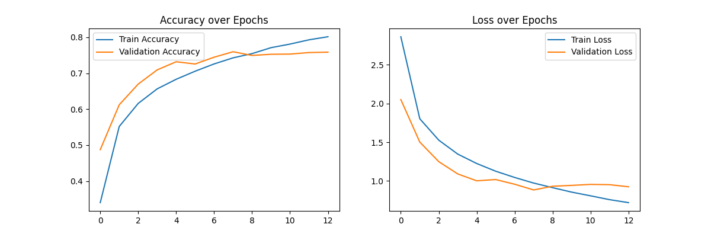
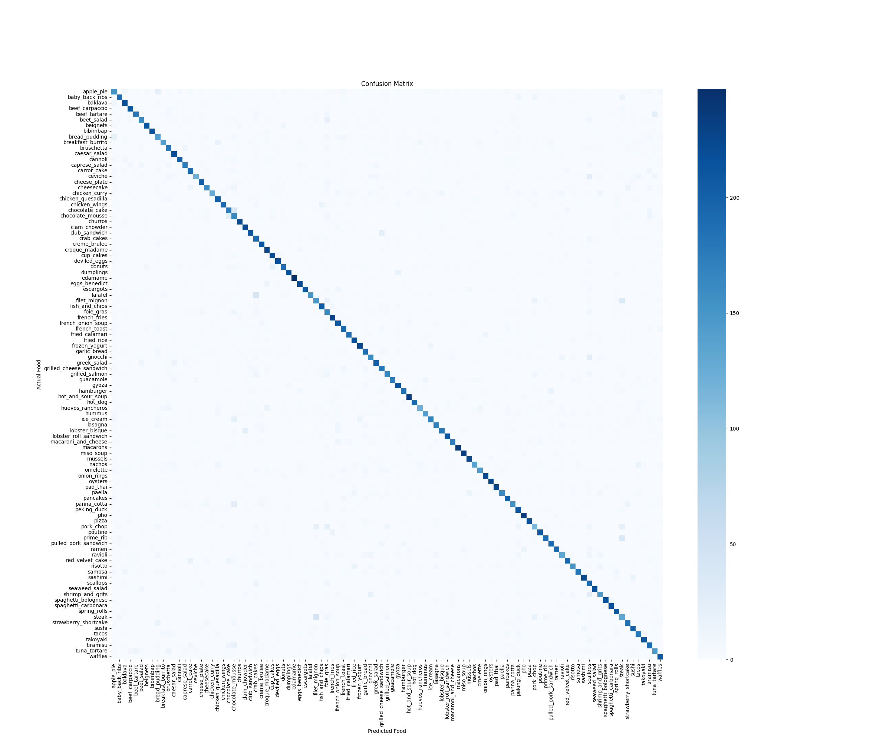

# FoodVision AI 🍕🔬

An end-to-end image classification application that identifies 101 different food categories and estimates nutritional information using Deep Learning.

## 🚀 Project Overview
FoodVision AI leverages a fine-tuned **MobileNetV2** architecture to provide high-accuracy food recognition. It features a modern React/Next.js frontend and a high-performance Flask backend, allowing users to upload images and receive instant predictions with confidence scores and caloric data.

### Key Features
* **Deep Learning Model:** Fine-tuned MobileNetV2 achieving **~76% Validation Accuracy**.
* **Real-time Inference:** Fast image processing and prediction pipeline.
* **Calorie Mapping:** Comprehensive database mapping 101 food classes to estimated caloric values.
* **Responsive UI:** A sleek, side-by-side dashboard for seamless user experience.

---

## 🏗️ Technical Architecture

### 🧠 The Model (Kaggle)
* **Base Model:** MobileNetV2 (Pre-trained on ImageNet).
* **Technique:** Transfer Learning followed by selective Fine-Tuning.
* **Optimization:** * Unfrozen the top 54 layers for domain-specific feature extraction.
    * Adam Optimizer with a reduced learning rate ($1 \times 10^{-4}$) for stable convergence.
    * Data Augmentation (Random Rotation, Flip) to prevent overfitting.

### ⚙️ Backend (Flask)
* **Language:** Python
* **Package Manager:** `uv`
* **Core Libraries:** TensorFlow, NumPy, Pillow, Flask-CORS.
* **Functionality:** Handles image preprocessing (MobileNetV2 spec), model inference, and metadata lookup.

### 🎨 Frontend (React/TypeScript)
* **Framework:** Next.js / React
* **Styling:** Tailwind CSS
* **Icons:** Lucide-React / Heroicons
* **Functionality:** Async file uploads, real-time preview, and dynamic result rendering.

---

## 🛠️ Installation & Setup

### Prerequisites
* Python 3.9+
* Node.js & npm
* `uv` (Python package manager)

### 1. Backend Setup
```bash
cd Backend
# Create pyproject.toml and install dependencies
uv sync
# Ensure model.h5 and classes.txt are in the Backend folder
uv run main.py
```

### 2. Frontend Setup
```bash
# Navigate to frontend directory
npm install
npm run dev
```

---

## 📊 Model Evaluation (v0.1)

The current version of the model utilizes a fine-tuned MobileNetV2 architecture. Detailed metrics and training visualizations are stored in [`/evaluation/model-version0.1/`](./evaluation/model-version0.1/).

### Training Metrics
* **Final Validation Accuracy:** 75.9%
* **Final Training Accuracy:** 80.1%
* **Loss:** 0.71

### Performance Visuals
| Accuracy & Loss Curves | Confusion Matrix |
| :---: | :---: |
|  |  |

> **Analysis:** The model shows strong convergence. The slight gap between training and validation accuracy (~4%) indicates a well-regularized model that generalizes well to unseen data.

---

## 📁 Project Structure
```text
FoodVision/
├── Backend/
│   ├── main.py            # Flask Server & Inference Logic
│   ├── model.h5           # Trained Keras Model
│   ├── classes.txt        # 101 Food Labels
│   └── pyproject.toml     # UV Dependencies
├── Frontend/
│   ├── src/
│   │   └── app/page.tsx   # React Dashboard
│   └── tailwind.config.js # Styling Configuration
└── README.md
```

## 👨‍💻 Author
**Sakib Mansuri** *Software Engineering Student at Seneca Polytechnic* [GitHub Profile](https://github.com/sakib078)
